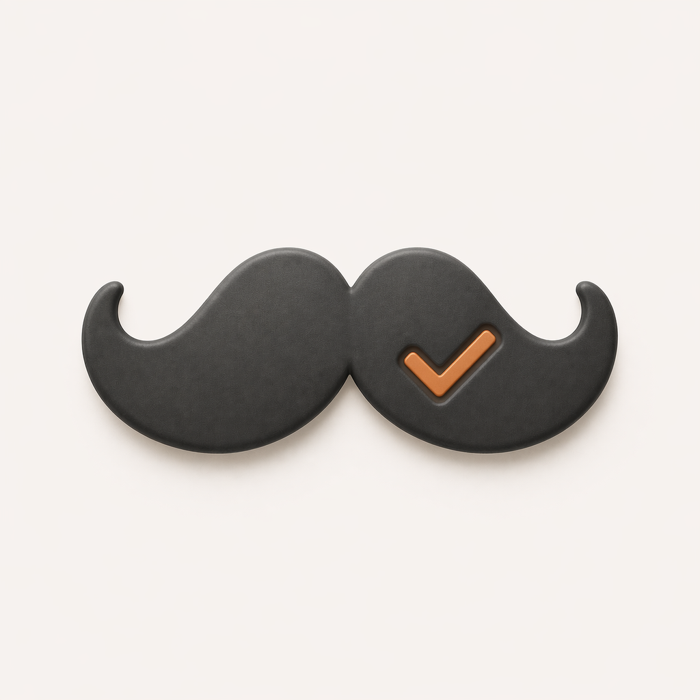

# JoeDo

A minimalist, gesture-driven to-do app for macOS. Lives in your menu bar. Type less, click less, tick more.

Inspired by the iOS app **Clear** — coloured heatmap rows, bold typography, no chrome. JoeDo is the desktop take.

<p align="center">
  
</p>

## Features

- **Menu-bar-first**: by default JoeDo lives in your menu bar. Click the checklist icon for a 440×560 popover with all your lists and tasks.
- **Heatmap rows**: row colour = priority. Top of the list is the hottest, bottom the chillest. Five themes: Heatmap, Sunset, Night Owl, Grass, Ultraviolet.
- **Gestures**:
  - Swipe a row **right** → complete
  - Swipe a row **left** → delete
  - Hover a row → drag the `≡` grip to reorder
  - Trackpad pinch apart → add a new task/list
- **Keyboard-friendly**:
  - `⌘N` — new list / new task
  - `⌘F` — search the current screen
  - `⌘[` — back to Lists
  - `⌘Z` / `⇧⌘Z` — undo / redo
  - `⇧⌘K` — clear completed
  - `⌃⌘J` — **global quick-add** from any app
  - `⌘,` — Settings (anchors under the menu-bar icon)
- **Three modes**: Menu-Bar-Only (default), Window + Menu Bar — switch in Settings → App Location.
- **Undo everywhere**: SwiftData-backed, `UndoManager`-aware.
- **Welcome on first run**: a single image floats over the screen; click to dismiss.

## Install

1. Download the latest `Joedo.dmg` from the **Releases** page.
2. Double-click the DMG → drag `Joedo.app` into **Applications**.
3. The app is **ad-hoc signed** (no paid Apple Developer account). The very first launch will show *"Joedo is not from an identified developer."*
   - Right-click `Joedo.app` → **Open** → **Open** on the confirmation sheet.
   - This happens once. Future launches are silent.
4. Check your menu bar (top-right of screen) for the Joedo icon.

## Build from source

Requires **Xcode 26** (or later) on **macOS 14 Sonoma+**. Swift 6.

```bash
git clone git@github.com:markstent/JoeDo.git
cd JoeDo/Joedo
open Joedo.xcodeproj
```

Then ⌘R in Xcode.

### Build a distributable DMG

```bash
cd Joedo
./scripts/build_dmg.sh
```

Produces `dist/Joedo.dmg`. Ad-hoc signed, volume icon applied, 4.4 MB.

### Reset all app state (for testing first-launch experience)

```bash
cd Joedo
./scripts/reset_state.sh
```

Wipes the SwiftData store, preferences, and welcome flag so the next launch behaves like a brand-new install.

## Architecture

- **SwiftUI + SwiftData**, no third-party dependencies.
- `ListsHomeView` / `TaskListView` — heatmap row UI.
- `RowView` — shared full-bleed coloured row with swipe + tap gestures.
- `MenuBarController` — `NSStatusItem`-based, right-click menu for Settings / Help / Quit.
- `GlobalHotkey` — Carbon `RegisterEventHotKey` for `⌃⌘J` quick-add.
- `WelcomeWindowController` — one-off floating `NSPanel` for the welcome image.
- `AudioController` — generates ascending pentatonic chimes in-memory via WAV/`NSSound`.
- `DesignSystem.swift` — central tokens for typography, spacing, opacity, motion.

## Repo layout

```
README.md                       This file.
.gitignore
Joedo/                          Xcode project
├── Joedo.xcodeproj/
├── Joedo/                      Source code
│   ├── JoedoApp.swift          @main entry point
│   ├── ContentView.swift       NavigationStack root
│   ├── DesignSystem.swift      Typography / spacing / opacity tokens
│   ├── Models/                 TaskList, TodoItem SwiftData entities
│   ├── Views/                  ListsHomeView, TaskListView, RowView, SettingsView, HelpWindow, WelcomeWindow, …
│   ├── Theme/                  Theme enum + Typography helpers
│   ├── Audio/                  AudioController
│   ├── MenuBarController.swift
│   ├── GlobalHotkey.swift
│   └── Assets.xcassets/
└── scripts/
    ├── build_dmg.sh            Build + sign + package DMG
    └── reset_state.sh          Wipe app state for first-launch testing
docs/                           Project plan + non-technical overview
source-assets/                  Master icon files (not bundled into the app directly)
```

## License

Private / personal use. No license declared.

---

Built with SwiftUI 6 on macOS 26 by Mark Stent.
